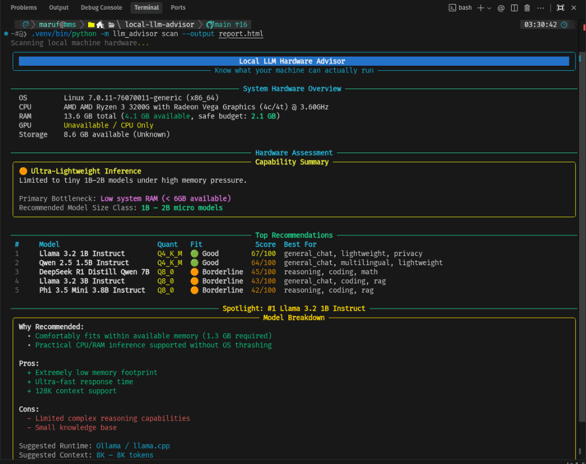
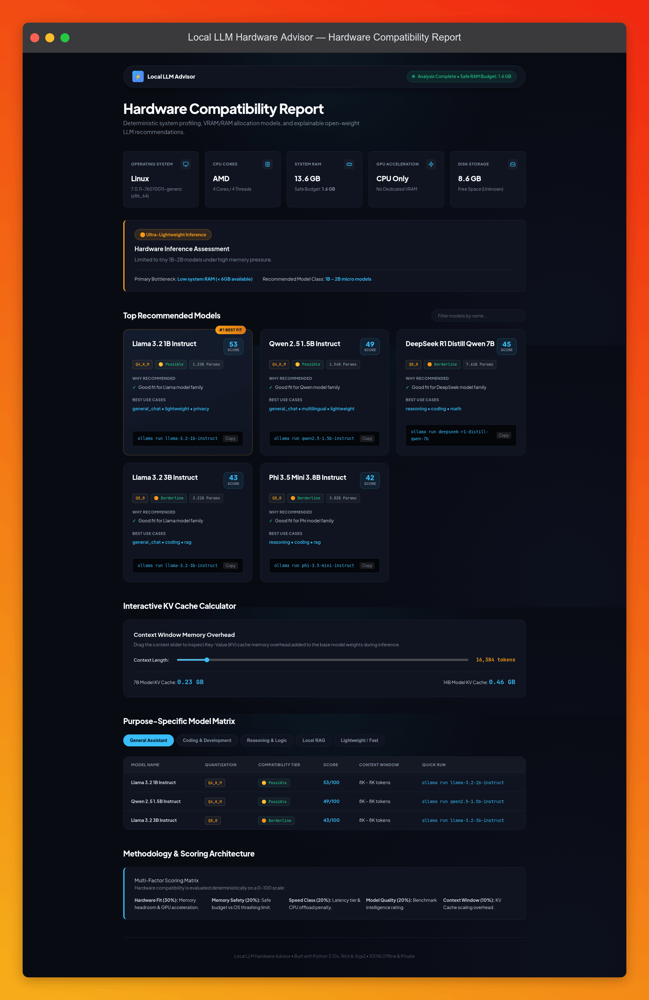

# Local LLM Hardware Advisor

[](https://github.com/blackstart-labs/local-llm-advisor/actions/workflows/ci.yml)
[](https://python.org)
[](LICENSE)

> **"Know what local LLMs your machine can actually run — offline, data-backed, and explainable."**

---

## Interface Previews

### Rich Terminal Report


### Standalone HTML Dashboard Report


---

## Overview

**Local LLM Hardware Advisor** is a developer utility that analyzes your hardware environment (CPU, RAM, GPU/VRAM, Storage, OS, local runtimes) and determines which **open-weight local LLMs** can realistically run on your machine.

Instead of generic "Can I run this?" checks, it provides data-backed analysis:
- **Recommended models & quantization levels** (Q4_K_M, Q5_K_M, Q8_0, FP16)
- **VRAM / RAM memory overhead calculation** (Weights + KV Cache + Runtime Reserve)
- **Multi-factor score breakdown** (Hardware fit, headroom, expected speed, model quality, context support)
- **Purpose-focused rankings** (Coding, Reasoning, General Assistant, Local RAG, Lightweight)
- **Primary hardware bottlenecks & upgrade suggestions**

Runs **100% offline & locally** without requiring cloud APIs.

---

## Quick Start

### Installation

```bash
# Clone the repository
git clone https://github.com/blackstart-labs/local-llm-advisor.git
cd local-llm-advisor

# Create virtualenv and install package
python3 -m venv .venv
source .venv/bin/activate
pip install -e .
```

### Basic Commands

```bash
# Scan hardware and print terminal report
llm-advisor scan

# Scan and export self-contained HTML report dashboard
llm-advisor scan --output report.html --open

# Output machine-readable JSON
llm-advisor scan --json

# Recommend models specifically for Coding
llm-advisor recommend --purpose coding

# List all models in catalog
llm-advisor models

# Inspect specific model details
llm-advisor model qwen2.5-7b-instruct
```

---

## "Your Machine Isn't Just RAM"

Running LLMs locally depends on multiple hardware factors:
1. **Available Memory vs Total RAM**: Allocating 100% of RAM causes OS swap thrashing. We apply a conservative **Safe RAM Budget** formula.
2. **Dedicated VRAM vs System RAM**: Full GPU offloading yields 5x–10x token speeds compared to CPU offloading.
3. **KV Cache Overhead**: Memory scales linearly with context length ($8\text{K} \to 128\text{K}$).
4. **Quantization Precision**: Lower precision (Q4_K_M) cuts memory needs by ~50% with ~97% quality retention.

---

## Architecture & Extensibility

```
src/llm_advisor/
├── hardware/    # Cross-platform hardware detectors (Linux, macOS, Windows)
├── models/      # Open-weight LLM catalog & schema registry
├── analysis/    # Compatibility rules & 5-factor scoring engine
├── reporting/   # Rich terminal UI & Jinja2 HTML report dashboard
├── cli/         # Typer CLI commands
└── utils/       # Browser utilities
```

Adding new models to the catalog is simple — just update `src/llm_advisor/models/catalog.py`!

---

## Development & Testing

```bash
# Run test suite
pytest

# Test coverage
pytest --cov=src/llm_advisor --cov-report=term-missing

# Lint & Typecheck
ruff check src tests
mypy src
```

---

## License

[MIT License](LICENSE)